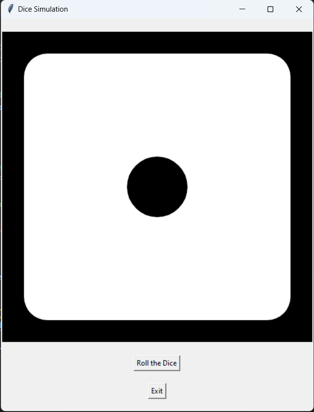

# Dice Simulation 🎲

Simulate a dice roll with a simple and intuitive GUI!

## Details

**Programming Language**: Python 3

**Modules Needed**:
- `tkinter`: For the graphical user interface. Usually comes pre-installed with Python.
- `random`: For generating random numbers. Part of the Python Standard Library.
- `os`: To handle directory paths. Part of the Python Standard Library.

## Features

1. **Simple GUI**: Intuitive and easy-to-use interface.
2. **Random Dice Rolls**: Simulate dice rolls with a click of a button.
3. **High-Quality Images**: Features high-resolution images for each dice face.

## Getting Started

### Prerequisites

Ensure you have Python 3 installed on your machine. 

### Installation

1. Clone the repository: git clone https://github.com/Bisalkumar/Dice_Simulation_Game.git
2. Navigate to the directory and run the game: python game.py

## How to Use

1. Launch the application.
2. Click on the "Roll the Dice" button to simulate a dice roll.
3. The dice face will update based on the roll.
4. Click "Exit" to close the application.

## Screenshots

## Contributions

Contributions are always welcome! Please see the `CONTRIBUTING.md` file for more details (if you decide to include one).

## License

This project is licensed under the MIT License. See the `LICENSE` file for more details.

## Acknowledgement

Thanks to google and the Python community for invaluable resources and support.

